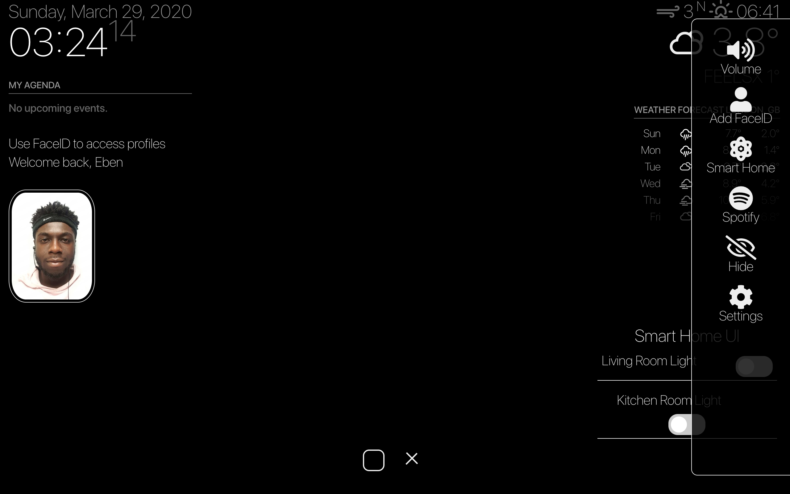

# MMM-Face-Recognition-SMAI

A module for the [MagicMirror](https://github.com/MichMich/MagicMirror) project by [SmartBuilds.io](http:smartbuilds.io) adding (faceID) face recognition.

## How it works
This module allows you to access profiles using face recognition. This works on the back of OpenCV face recognition module.

## Screenshots
|  |  |  |
|---|---|---|
| User has been recognised | A guest profile as default | Overview of MagicMirror UI |


## Preconditions

* MagicMirror<sup>2</sup> instance
* Node.js version >= 7
* npm
* OpenCV face-recognition
* Raspberry Pi 4 Camera Module


## Step 1 – Install the module
In your MagicMirror directory:

```bash cd modules
   git clone https://github.com/EbenKouao/MMM-Face-Recognition-SMAI.git
   cd MMM-face-rec
   npm install
```

## Step 2 – Add files to the Config.js
Here is an example for an entry in `config.js`

```javascript
{
  module: "MMM-Face-Recognition-SMAI",
  position: "top_right",
  config: {
    //prompt: "Put in your own text"
  }
}
```